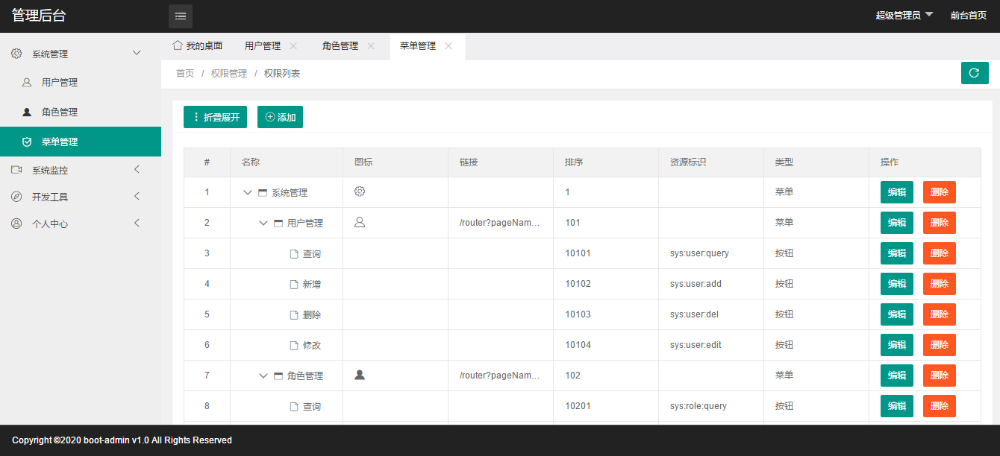

# boot-admin

## 介绍
基于SpringBoot的后台权限管理系统，可作为脚手架，用于快速搭建项目

## 功能
（1）用户管理  
（2）角色管理  
（3）菜单管理  
（4）druid数据源监控  
（5）swagger接口文档  
（6）代码生成：根据表结构和自定义模板自动生成model、dao、mapper.xml、service、serviceImpl、controller、html文件  
（7）权限控制：菜单级别、按钮级别、页面显示

## 技术选型
### 后端：
基础框架：Spring Boot  
ORM：Mybatis  
数据库：MySql
权限：spring security
日志：logback

### 前端：
页面布局框架：X-admin、layui    
树型组件：[treetable-lay](https://gitee.com/whvse/treetable-lay)、ztree

## 开发环境  
jdk1.8  
IntelliJ IDEA  

## 页面布局

## 项目运行
运行地址：
http://localhost:8080  
账号密码：admin/123456

## 页面截图 
（1）登录界面

（2）主页

（3）用户管理

（4）角色管理

（5）菜单管理

（6）代码生成

